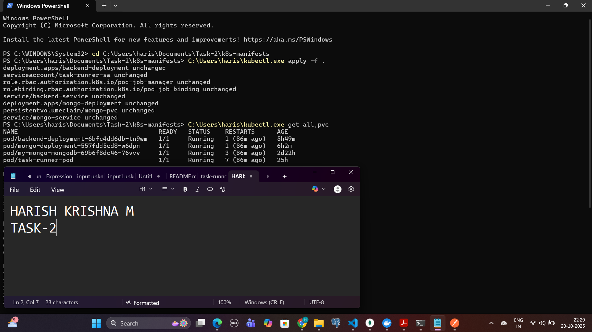
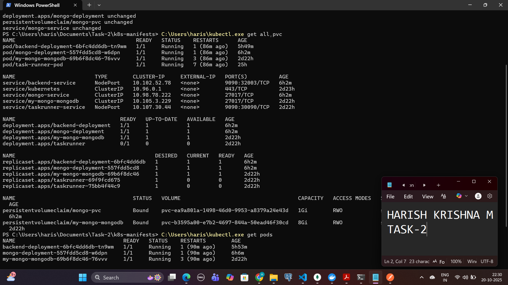

# Task 2: Kubernetes Deployment

This repository documents the deployment of the Task Runner application onto a Kubernetes cluster and the modification of its execution logic to leverage Kubernetes Jobs.

## 1. Overview

The primary goals of this task were to:

1.  **Containerize:** Package the Java backend application into a Docker image.
2.  **Orchestrate:** Define Kubernetes manifests (`Deployment`, `Service`, `PersistentVolumeClaim`, `RBAC`) to deploy the application and its MongoDB dependency onto a Kubernetes cluster.
3.  **Refactor Execution:** Modify the backend to programmatically create a new Kubernetes Job (running a `busybox` container) for each task execution, utilizing the Kubernetes API.
4.  **Configure:** Inject MongoDB connection details into the application via Kubernetes environment variables.
5.  **Persist Data:** Ensure MongoDB data survives pod restarts using a `PersistentVolumeClaim`.
6.  **Expose:** Make the application's API endpoints accessible from the host machine.

## 2. Technologies Used 🛠️

- **Backend:** Java 17, Spring Boot 3, Spring Data MongoDB, Maven
- **Containerization:** Docker
- **Orchestration:** Kubernetes (using Docker Desktop)
- **Kubernetes Client (Java):** Fabric8 Kubernetes Client
- **Database:** MongoDB (deployed via Kubernetes manifests)
- **API Testing:** Postman

## 3. Project Structure

The core of this task lies in the Kubernetes configuration files located in the `k8s-manifests` directory.

- **`k8s-manifests/`**
  - **`mongo-pvc.yml`**: Defines a `PersistentVolumeClaim` (PVC) requesting 1Gi of storage. This ensures that the data stored by MongoDB persists even if the MongoDB pod is deleted or recreated.
  - **`mongo-deployment.yml`**: Creates a Kubernetes `Deployment` to run the official `mongo:5.0` image in a dedicated pod. It mounts the `mongo-pvc` to `/data/db` inside the container.
  - **`mongo-service.yml`**: Creates a `ClusterIP` service named `mongo-service`. This provides a stable internal DNS name (`mongo-service`) and IP address for the MongoDB pod, allowing the backend application to connect to it reliably.
  - **`backend-rbac.yml`**: Configures Role-Based Access Control (RBAC). It creates a `ServiceAccount` (`task-runner-sa`), a `Role` (`pod-job-manager`) granting permissions to manage Pods and Jobs, and a `RoleBinding` (`pod-job-binding`) linking the ServiceAccount to the Role. This is crucial for allowing the backend application to interact with the Kubernetes API.
  - **`backend-deployment.yml`**: Creates a `Deployment` for the Java backend application, using the Docker image `harishkrishnamurali/task-runner-backend:latest`. Key configurations include:
    - Attaching the `task-runner-sa` ServiceAccount.
    - Injecting environment variables `MONGO_URI` (set to `mongodb://mongo-service:27017`) and `MONGO_DB_NAME` (set to `taskdb`).
  - **`backend-service.yml`**: Exposes the backend application externally using a `NodePort` service, mapping a port on the host machine to port 9090 on the backend pod.

## 4. Key Application Changes

The Task 1 Java application was modified for Kubernetes integration:

- **`K8sJobExecutorService.java`**: Replaced the previous Kubernetes executor. This service now implements the `ExecutorService` interface by creating a new Kubernetes `Job` for each `execute` call. The Job runs the command in a `busybox` container, waits for completion, retrieves the pod logs as the output, and then deletes the Job.
- **`application.yml`**: Changed to retrieve MongoDB connection details (`spring.data.mongodb.uri`, `spring.data.mongodb.database`) from environment variables (`MONGO_URI`, `MONGO_DB_NAME`), enabling configuration injection via Kubernetes. The `k8s` Spring profile is activated to ensure the `K8sJobExecutorService` is used.
- **Dependencies:** Added the `fabric8-kubernetes-client` dependency to interact with the Kubernetes API.

## 5. Deployment Steps

1.  **Start Kubernetes Cluster:** Ensure your local Kubernetes cluster (Docker Desktop) is running.
2.  **Build & Push Image:** Build the updated Java application and push the Docker image to Docker Hub:

    # Navigate to Task-2 project root

    mvnw.cmd clean package -DskipTests
    docker build -t harishkrishnamurali/task-runner-backend:latest .
    docker push harishkrishnamurali/task-runner-backend:latest

3.  **Apply Manifests:** Navigate to the `k8s-manifests` directory and apply all YAML files:

    cd k8s-manifests
    kubectl apply -f .

## 6. Verification

Verification involves confirming the Kubernetes resources are running and testing the API functionality using port-forwarding.

### Kubernetes Resources Status

Confirm all pods are running and the PVC is bound:
kubectl get all,pvc

API Interaction via Port-Forward
Establish a direct connection to the backend pod:

# Get the backend pod name (e.g., backend-deployment-xxxx-yyyy)

kubectl get pods

# Start port-forwarding (leave this terminal running)

kubectl port-forward pod/<your-backend-pod-name> 9090:9090

